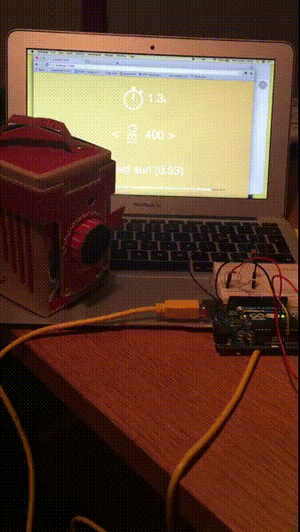

**A [nodeschool][1] type workshop to create an IoT Smart Pinhole Camera**

```shell
# Install
npm install -g smart-pinhole-workshop

# Run
smart-pinhole-workshop
```

## Overview

We want you to learn __core Internet of Things__ principles by discovery in one weekend. But normally the workshop takes 1 - 2 hours to complete.

We keep things simple. This means we will not hack the [__Pinhole Camera__][4] directly. Instead, the hardware can placed alongside the camera. Enough to showcase what a smart camera can do.

### How smart?

Our objective is to figure out how bright a space is. Then use some basic calculations to tell a photographer how long the camera film should be exposed for.

### The end result



### How things fit together

We will sense brightness using [Johnny Five](http://johnny-five.io) and a cheap light sensor on the Arduino, push that data over the internet and create a real time UI to showcase the optimal film exposure time for a photo.


**The workshop will pose a challenge, and test your solution.**

You can use your favourite text editor to create a solution.

Each of your solutions can be run directly as a `node` program like this:

[](https://asciinema.org/a/7j43i5cvd3upi90aagharrfcz?autoplay=1&speed=1.5)

**To start fast, _NO_ Arduino OR Pinhole Camera is needed for this workshop.**

Sample data is pushed through the solution to simulate the experience.

But wire up an [Arduino UNO][2], connect the USB and you can see your solution run for real.

For the `Pinhole Camera`, [either make your own][3] or [get one from here][4].

## Exhaustive bill of materials

Here's the list of all the materials to run your solution 100% end to end.

- LED - http://node-ardx.org/electronics-primer#led
- Photoresistor - http://node-ardx.org/electronics-primer#photoresistor
- Resistor - http://node-ardx.org/electronics-primer#resistor
- Breadboard - http://node-ardx.org/electronics-primer#breadboard
- 3 Jump wires - https://en.wikipedia.org/wiki/Jump_wire
- [Arduino UNO][2]
- Pinhole Camera - [make one][3] / [buy one][4]

## Pre-requisites for the Arduino

Tested with node.js v0.12. You may have problems with v4 and native modules.

### Flash your Arduino with Standard Firmata:

- Connect the Arduino UNO to your PC using the USB Cable
- Open the Arduino IDE, select: File > Examples > Firmata > StandardFirmata
- Click the "Upload" button.
- The text "Done Uploading" will appear once the upload is complete.

### Having problems? Perhaps adjust one of the following.

* Select : Tools > Board and ensure that "Arduino UNO" is selected.
* Select : Tools > Serial Port and select another serial port.
   On a Mac the correct port may look like "/dev/tty.usbmodem:1411" or "/dev/cu.usbmodem:1411".
* Check the USB Cable is connected - consider also trying a different cable.
* You can also try pressing the Reset Button on the UNO.

They try the upload process one more time.

## Feedback

We want feedback! [Let us know what you thought, good or bad](mailto:hello@cardboardiot.com?subject=Demo+workshop+feedback).

## Code style

To move towards a consistent style for nodeschool projects we use the .jshintrc
as defined in learnyounode: https://github.com/rvagg/learnyounode/blob/master/.jshintrc

Your favourite jshint runner will work. And, a gulpfile is provided.

```shell
npm install -g gulp
gulp
```


[1]: http://nodeschool.io/
[2]: https://www.arduino.cc/en/Main/ArduinoBoardUno
[4]: http://thepopuppinholecompany.com/viddy
[3]: http://www.instructables.com/id/How-To-Make-A-Pinhole-Camera/
